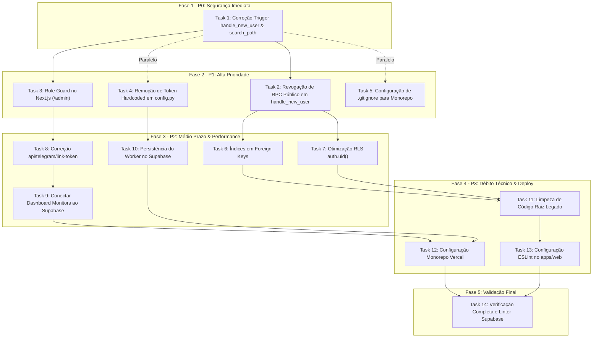

# Plano de Correção e Remediação Técnica (CursoRadar)

> **For agentic workers:** REQUIRED SUB-SKILL: Use `superpowers:subagent-driven-development` (recommended) or `superpowers:executing-plans` to implement this plan task-by-task. Steps use checkbox (`- [ ]`) syntax for tracking.

**Goal:** Remediar todas as vulnerabilidades de segurança (P0/P1), gargalos de performance no Postgres/RLS (P2), persistência desconectada do frontend e worker (P2), e débitos técnicos de monorepo/deploy (P3) identificados no `AUDIT_REPORT.md` do CursoRadar, mantendo isolamento absoluto com o projeto Trenex.

**Architecture:** Correções aplicadas incrementalmente em 4 fases sequenciais por prioridade:
1. Migrações de segurança PostgreSQL aplicadas exclusivamente no projeto CursoRadar (`rbqqilyupzyibacytdwp`).
2. Proteção de rotas Next.js 15 App Router e higienização de credenciais no Worker Python.
3. Criação de índices de chaves estrangeiras, refatoração de políticas RLS para $O(1)$ (`(SELECT auth.uid())`) e integração com Supabase SSR client.
4. Padronização do monorepo, configuração de deploy na Vercel e saneamento de código legado.

**Tech Stack:** Next.js 15 (App Router), TypeScript, Tailwind CSS, Supabase (PostgreSQL 15, Auth, RLS, PostgREST), Python 3.11+, Pydantic v2, pytest, uv, Vercel CLI.

**Spec:** [`AUDIT_REPORT.md`](file:///c:/Users/gusta/Documents/antigravity/silly-volta/AUDIT_REPORT.md)

---

## Global Constraints

- **ISOLAMENTO ABSOLUTO:** O projeto **Trenex** (`exyelntdpfbjyxkryrxj`) NUNCA deve ser modificado, migrado, pausado ou acessado para mutação. Qualquer comando SQL ou API deve ter como alvo exclusivo o projeto **CursoRadar** (`rbqqilyupzyibacytdwp`).
- **MODO DE EXECUÇÃO:** Nenhuma etapa deste plano deve ser executada sem autorização explícita prévia do usuário.
- **SEM DADOS SENSÍVEIS NO GIT:** Nenhum token, chave de serviço ou senha pode ser commitado. Chaves locais pertencem unicamente a `.env.local` (ignorado pelo git).
- **CONFORMIDADE COM SKILLS:** Todas as queries SQL e policies RLS devem obedecer estritamente às diretrizes de `supabase` e `supabase-postgres-best-practices`.

---

## Matriz de Fases, Dependências e Paralelismo



| Fase | Tasks | Paralelizável com | Risco de Quebra |
| :--- | :--- | :--- | :--- |
| **Fase 1 (P0)** | Task 1 | N/A (Bloqueante para T2, T3) | **Baixo** (Novos cadastros recebem 'user'; admins existentes intocados) |
| **Fase 2 (P1)** | Task 2, Task 3, Task 4, Task 5 | T4 e T5 são independentes de T2/T3 | **Baixo** (T3 bloqueia usuários comuns de ver `/admin`) |
| **Fase 3 (P2)** | Task 6, Task 7, Task 8, Task 9, Task 10 | T6/T7 (DB) em paralelo com T8/T9 (Web) e T10 (Worker) | **Médio** (Requer migrações e testes de queries) |
| **Fase 4 (P3)** | Task 11, Task 12, Task 13 | T11, T12 e T13 são totalmente independentes | **Baixo** (Higiene de código e configs de CI) |
| **Fase 5** | Task 14 | N/A (Gate final de entrega) | **Zero** (Somente leitura e verificação) |

---

## Fase 1: P0 — Segurança Imediata

### Task 1: Correção de Escalada de Privilégios no Trigger `handle_new_user` e `search_path`

**Files:**
- Create: `supabase/migrations/20260917010000_fix_security_definer_and_privileges.sql`
- Modify: `supabase/migrations/20260917000000_init_multiuser_schema.sql:40-55` (documentação histórica)
- Test: Validação via Supabase MCP `execute_sql` e teste de signup no Next.js

**Interfaces:**
- Consumes: Trigger `on_auth_user_created` em `auth.users`
- Produces: Função `public.handle_new_user()` segura com `role = 'user'` fixo e `search_path` explícito

- [ ] **Step 1: Criar arquivo de migração para corrigir a função e o search_path**

```sql
-- supabase/migrations/20260917010000_fix_security_definer_and_privileges.sql
-- ==============================================================================
-- CORREÇÃO P0: Prevenção de escalada de privilégios e search_path hijacking
-- ==============================================================================

-- 1. Atualizar handle_new_user para forçar role = 'user' independente dos metadados fornecidos pelo cliente
CREATE OR REPLACE FUNCTION public.handle_new_user()
RETURNS TRIGGER 
LANGUAGE plpgsql 
SECURITY DEFINER 
SET search_path = public, pg_temp
AS $$
BEGIN
  INSERT INTO public.profiles (id, email, name, role, status)
  VALUES (
    NEW.id,
    NEW.email,
    COALESCE(NEW.raw_user_meta_data->>'name', split_part(NEW.email, '@', 1)),
    'user', -- FORÇADO: Papel nunca pode ser injetado por raw_user_meta_data
    'active'
  )
  ON CONFLICT (id) DO UPDATE SET
    email = EXCLUDED.email,
    name = COALESCE(public.profiles.name, EXCLUDED.name);
  RETURN NEW;
END;
$$;

-- 2. Corrigir search_path da função is_admin()
CREATE OR REPLACE FUNCTION public.is_admin()
RETURNS BOOLEAN 
LANGUAGE sql 
SECURITY DEFINER 
STABLE
SET search_path = public, pg_temp
AS $$
  SELECT EXISTS (
    SELECT 1 FROM public.profiles
    WHERE id = auth.uid() AND role = 'admin' AND status = 'active'
  );
$$;

-- 3. Corrigir search_path da função set_current_timestamp_updated_at()
CREATE OR REPLACE FUNCTION public.set_current_timestamp_updated_at()
RETURNS TRIGGER 
LANGUAGE plpgsql
SET search_path = public, pg_temp
AS $$
BEGIN
  NEW.updated_at = NOW();
  RETURN NEW;
END;
$$;
```

- [x] **Step 1: Criar arquivo de migração para corrigir a função e o search_path**
- [x] **Step 2: Aplicar a migração exclusivamente no projeto CursoRadar via Supabase MCP**
- [x] **Step 3: Verificar que o advisor de search_path foi resolvido para as 3 funções**
- [x] **Step 4: Testar que injeção de role via metadata não concede admin**
- [x] **Step 5: Commit/Validação das alterações**

```bash
git add supabase/migrations/20260917010000_fix_security_definer_and_privileges.sql
git commit -m "fix(security): sanitize handle_new_user role assignment and enforce search_path (P0)"
```

---

## Fase 2: P1 — Alta Prioridade

### Task 2: Revogação de Acesso RPC Público em Funções de Trigger e Sistema

**Files:**
- Create: `supabase/migrations/20260917020000_revoke_rpc_public_execution.sql`
- Test: Supabase MCP `execute_sql` e verificação de permissões via `information_schema.routine_privileges`

**Interfaces:**
- Consumes: Funções `public.handle_new_user`, `public.set_current_timestamp_updated_at`
- Produces: Acesso RPC bloqueado para `anon` e `authenticated` via PostgREST

- [ ] **Step 1: Criar migração revogando privilégios de execução pública**

```sql
-- supabase/migrations/20260917020000_revoke_rpc_public_execution.sql
-- ==============================================================================
-- CORREÇÃO P1: Revogar execução pública de funções internas via PostgREST RPC
-- ==============================================================================

-- Funções que são disparadas apenas por triggers ou tarefas internas
REVOKE EXECUTE ON FUNCTION public.handle_new_user() FROM PUBLIC, anon, authenticated;
REVOKE EXECUTE ON FUNCTION public.set_current_timestamp_updated_at() FROM PUBLIC, anon, authenticated;

-- Garantir que apenas o executor de triggers (postgres e supabase_auth_admin) tenha permissão
GRANT EXECUTE ON FUNCTION public.handle_new_user() TO postgres, supabase_auth_admin;
GRANT EXECUTE ON FUNCTION public.set_current_timestamp_updated_at() TO postgres, authenticated, service_role;
```

- [x] **Step 1: Criar migração revogando privilégios de execução pública**
- [x] **Step 2: Aplicar a migração no CursoRadar (`rbqqilyupzyibacytdwp`)**
- [x] **Step 3: Testar tentativa de invocação RPC e verificar privilégios**
- [x] **Step 4: Validação da revogação P1**

```bash
git add supabase/migrations/20260917020000_revoke_rpc_public_execution.sql
git commit -m "fix(security): revoke public RPC execution on trigger functions (P1)"
```

---

### Task 3: Proteção e Guard de Acesso Administrativo (`/admin`) no Next.js

**Files:**
- Modify: `apps/web/src/lib/supabase/middleware.ts:45-55`
- Modify: `apps/web/src/app/admin/layout.tsx:1-44`
- Test: `apps/web` teste de navegação autenticado como `user` e como `admin`

**Interfaces:**
- Consumes: Supabase Auth Session e tabela `public.profiles`
- Produces: Redirecionamento forçado para `/dashboard` (com mensagem de acesso negado) quando usuário não for admin

- [ ] **Step 1: Atualizar o middleware do Next.js para validar a role admin em rotas `/admin`**

Modificar [apps/web/src/lib/supabase/middleware.ts](file:///c:/Users/gusta/Documents/antigravity/silly-volta/apps/web/src/lib/supabase/middleware.ts):
```typescript
  const isAuthRoute =
    request.nextUrl.pathname.startsWith("/login") ||
    request.nextUrl.pathname.startsWith("/register");

  const isProtectedRoute =
    request.nextUrl.pathname.startsWith("/dashboard") ||
    request.nextUrl.pathname.startsWith("/admin");

  const isAdminRoute = request.nextUrl.pathname.startsWith("/admin");

  if (!user && isProtectedRoute) {
    const url = request.nextUrl.clone();
    url.pathname = "/login";
    return NextResponse.redirect(url);
  }

  // Se o usuário tentar acessar rota admin, checar perfil no Supabase
  if (user && isAdminRoute) {
    const { data: profile } = await supabase
      .from("profiles")
      .select("role, status")
      .eq("id", user.id)
      .single();

    if (!profile || profile.role !== "admin" || profile.status !== "active") {
      const url = request.nextUrl.clone();
      url.pathname = "/dashboard";
      url.searchParams.set("error", "unauthorized_admin");
      return NextResponse.redirect(url);
    }
  }

  if (user && isAuthRoute) {
    const url = request.nextUrl.clone();
    url.pathname = "/dashboard";
    return NextResponse.redirect(url);
  }
```

- [ ] **Step 2: Converter `apps/web/src/app/admin/layout.tsx` em Server Component seguro com verificação de role**

Substituir [apps/web/src/app/admin/layout.tsx](file:///c:/Users/gusta/Documents/antigravity/silly-volta/apps/web/src/app/admin/layout.tsx):
```tsx
import { redirect } from "next/navigation";
import { createClient } from "@/lib/supabase/server";
import { ShieldCheck, ShieldAlert } from "lucide-react";
import { AdminShell } from "@/components/admin/admin-shell";

export default async function AdminLayout({
  children,
}: {
  children: React.ReactNode;
}) {
  const supabase = await createClient();
  const { data: { user } } = await supabase.auth.getUser();

  if (!user) {
    redirect("/login");
  }

  const { data: profile } = await supabase
    .from("profiles")
    .select("role, status")
    .eq("id", user.id)
    .single();

  if (!profile || profile.role !== "admin") {
    redirect("/dashboard?error=access_denied");
  }

  return (
    <AdminShell user={user} profile={profile}>
      {children}
    </AdminShell>
  );
}
```

- [ ] **Step 3: Criar componente de cliente `AdminShell` para gerenciar estado da sidebar**

Criar [apps/web/src/components/admin/admin-shell.tsx](file:///c:/Users/gusta/Documents/antigravity/silly-volta/apps/web/src/components/admin/admin-shell.tsx):
```tsx
"use client";

import { useState } from "react";
import { Sidebar } from "@/components/sidebar";
import { Navbar } from "@/components/navbar";
import { ShieldCheck } from "lucide-react";

export function AdminShell({
  children,
  user,
  profile,
}: {
  children: React.ReactNode;
  user: any;
  profile: any;
}) {
  const [mobileOpen, setMobileOpen] = useState(false);

  return (
    <div className="flex min-h-screen flex-col bg-slate-50">
      <Navbar onToggleSidebar={() => setMobileOpen(true)} />

      <div className="bg-gradient-to-r from-purple-700 to-indigo-700 text-white px-6 py-2 text-xs flex items-center justify-between shadow-inner">
        <div className="flex items-center gap-2 font-medium">
          <ShieldCheck className="h-4 w-4" />
          <span>Área Restrita Administrativa: Acesso verificado ({profile.role.toUpperCase()})</span>
        </div>
        <span className="font-mono bg-purple-900/60 px-2 py-0.5 rounded text-[11px]">
          ROLE: ADMIN
        </span>
      </div>

      <div className="flex flex-1">
        <Sidebar
          isAdmin={true}
          mobileOpen={mobileOpen}
          onClose={() => setMobileOpen(false)}
        />
        <main className="flex-1 p-6 md:p-8 max-w-7xl w-full mx-auto">
          {children}
        </main>
      </div>
    </div>
  );
}
```

- [x] **Step 1: Atualizar o middleware do Next.js para validar a role admin em rotas `/admin`**
- [x] **Step 2: Converter `apps/web/src/app/admin/layout.tsx` em Server Component seguro com verificação de role**
- [x] **Step 3: Criar componente de cliente `AdminShell` para gerenciar estado da sidebar**
- [x] **Step 4: Testar compilação do Next.js (19/19 rotas compiladas e tsc 0 erros)**
- [x] **Step 5: Validação da proteção /admin P1**

```bash
git add apps/web/src/lib/supabase/middleware.ts apps/web/src/app/admin/layout.tsx apps/web/src/components/admin/admin-shell.tsx
git commit -m "feat(security): enforce server-side and middleware admin role guards for /admin (P1)"
```

---

### Task 4: Remoção de Credencial Hardcoded em `services/monitor/app/config.py`

**Files:**
- Modify: `services/monitor/app/config.py:76-80`
- Modify: `app/config.py:76-80`
- Modify: `services/monitor/tests/conftest.py` ou fixtures de teste
- Test: `uv run pytest services/monitor/tests -v`

**Interfaces:**
- Consumes: Variável de ambiente `SENAC_BOLSA_AUTH`
- Produces: `Settings.senac_bolsa_auth` sem valor default sensível em código

- [ ] **Step 1: Modificar o campo `senac_bolsa_auth` para não ter valor hardcoded no código**

Editar [services/monitor/app/config.py](file:///c:/Users/gusta/Documents/antigravity/silly-volta/services/monitor/app/config.py) e [app/config.py](file:///c:/Users/gusta/Documents/antigravity/silly-volta/app/config.py):
```python
    senac_bolsa_auth: str = Field(
        default="",
        description="Authorization header para API de bolsas do Senac SP (definido via env var SENAC_BOLSA_AUTH)",
        alias="SENAC_BOLSA_AUTH",
    )
```

- [ ] **Step 2: Atualizar `.env.example` para documentar a variável sem expor a chave real**

Verificar e garantir que `.env.example` contém:
```env
SENAC_BOLSA_AUTH="seu_token_aqui"
```

- [x] **Step 1: Modificar o campo `senac_bolsa_auth` para não ter valor hardcoded no código**
- [x] **Step 2: Atualizar `.env.example` para documentar a variável sem expor a chave real**
- [x] **Step 3: Executar testes de regressão do Python (34 passed)**
- [x] **Step 4: Validação da remoção de credencial P1**

```bash
git add services/monitor/app/config.py app/config.py .env.example
git commit -m "fix(security): remove hardcoded credential default in Settings (P1)"
```

---

### Task 5: Proteção de Segredos e Configuração de `.gitignore` para Monorepo

**Files:**
- Modify: `.gitignore`
- Test: `git status` confirmando que arquivos em `apps/web/.next` e `apps/web/.env.local` são ignorados

**Interfaces:**
- Consumes: Arquivos locais de build e ambiente
- Produces: Regras de ignore blindadas para Next.js, Node e Supabase

- [ ] **Step 1: Atualizar `.gitignore` na raiz com regras de monorepo**

Substituir [`.gitignore`](file:///c:/Users/gusta/Documents/antigravity/silly-volta/.gitignore) pelo conteúdo completo:
```gitignore
# Python
__pycache__/
*.py[cod]
*$py.class
*.so
.Python
env/
venv/
.venv/
build/
develop-eggs/
dist/
downloads/
eggs/
.eggs/
lib/
lib64/
parts/
sdist/
var/
wheels/
*.egg-info/
.installed.cfg
*.egg

# Database & runtime data
data/*.db
data/*.sqlite3
data/*.log
!data/.gitkeep

# Testing & coverage
.pytest_cache/
.coverage
htmlcov/

# Node & Next.js Monorepo
node_modules/
apps/*/node_modules/
.next/
apps/*/.next/
out/
apps/*/out/
build/
apps/*/build/

# Next.js bundle analysis
.next/analyze/
apps/*/.next/analyze/

# Environment variables & secrets (CRÍTICO)
.env
.env*.local
apps/*/.env*.local
services/*/.env*.local

# Logs
*.log
npm-debug.log*
yarn-debug.log*
yarn-error.log*
pnpm-debug.log*

# Supabase local
.supabase/
!supabase/config.toml

# IDE & OS
.vscode/
.idea/
*.swp
.DS_Store
Thumbs.db
```

- [x] **Step 1: Atualizar .gitignore na raiz com regras de monorepo**
- [x] **Step 2: Verificar status do Git e auditoria de segredos (0 rastreados)**
- [x] **Step 3: Validação da proteção Git P1**

```bash
git add .gitignore
git commit -m "chore: expand .gitignore with Next.js monorepo and local secrets rules (P1)"
```

---

## Fase 3: P2 — Médio Prazo, Performance e Persistência

### Task 6: Criação de Índices em Chaves Estrangeiras (Foreign Keys)

**Files:**
- Create: `supabase/migrations/20260917030000_add_foreign_key_indexes.sql`
- Test: Supabase MCP `get_advisors` (advisors `unindexed_foreign_keys` zerados)

**Interfaces:**
- Consumes: Tabelas `alerts`, `monitors`, `offers`
- Produces: 7 índices cobrindo todas as FKs pendentes

- [ ] **Step 1: Criar a migração com os 7 índices relacionais**

```sql
-- supabase/migrations/20260917030000_add_foreign_key_indexes.sql
-- ==============================================================================
-- OTIMIZAÇÃO P2: Índices para todas as Chaves Estrangeiras (FKs)
-- Previne sequential scans em JOINs e DELETEs em cascata
-- ==============================================================================

-- 1. Tabela alerts
CREATE INDEX IF NOT EXISTS idx_alerts_change_id ON public.alerts(change_id);
CREATE INDEX IF NOT EXISTS idx_alerts_monitor_id ON public.alerts(monitor_id);
CREATE INDEX IF NOT EXISTS idx_alerts_offer_id ON public.alerts(offer_id);

-- 2. Tabela monitors
CREATE INDEX IF NOT EXISTS idx_monitors_course_id ON public.monitors(course_id);
CREATE INDEX IF NOT EXISTS idx_monitors_location_id ON public.monitors(location_id);

-- 3. Tabela offers
CREATE INDEX IF NOT EXISTS idx_offers_course_id ON public.offers(course_id);
CREATE INDEX IF NOT EXISTS idx_offers_location_id ON public.offers(location_id);
```

- [ ] **Step 2: Aplicar migração no projeto CursoRadar via Supabase MCP**

Executar a migração e conferir criação com `SELECT indexname FROM pg_indexes WHERE schemaname = 'public';`.

- [ ] **Step 3: Validar advisor de Foreign Keys**

Chamar Supabase MCP `get_advisors` e confirmar que não há mais avisos do tipo `unindexed_foreign_keys`.

- [ ] **Step 4: Commit**

```bash
git add supabase/migrations/20260917030000_add_foreign_key_indexes.sql
git commit -m "perf(db): add missing covering indexes for foreign keys (P2)"
```

---

### Task 7: Otimização de Performance de RLS (`(SELECT auth.uid())` e `TO authenticated`)

**Files:**
- Create: `supabase/migrations/20260917040000_optimize_rls_policies.sql`
- Test: Supabase MCP `get_advisors` (advisors `auth_rls_initplan` zerados)

**Interfaces:**
- Consumes: Tabelas `profiles`, `telegram_link_tokens`, `monitors`, `monitor_preferences`, `alerts`
- Produces: Políticas RLS com avaliação $O(1)$ por query

- [ ] **Step 1: Criar migração recriando as políticas RLS otimizadas**

```sql
-- supabase/migrations/20260917040000_optimize_rls_policies.sql
-- ==============================================================================
-- OTIMIZAÇÃO P2: Refatoração de Políticas RLS para InitPlan (O(1))
-- Substitui auth.uid() por (SELECT auth.uid()) e restringe a authenticated
-- ==============================================================================

-- 1. PROFILES
DROP POLICY IF EXISTS "Users can read own profile" ON public.profiles;
DROP POLICY IF EXISTS "Users can update own profile" ON public.profiles;
DROP POLICY IF EXISTS "Admins full access on profiles" ON public.profiles;

CREATE POLICY "Users can read own profile" ON public.profiles
    FOR SELECT TO authenticated
    USING ((SELECT auth.uid()) = id OR is_admin());

CREATE POLICY "Users can update own profile" ON public.profiles
    FOR UPDATE TO authenticated
    USING ((SELECT auth.uid()) = id)
    WITH CHECK ((SELECT auth.uid()) = id AND role = 'user');

CREATE POLICY "Admins full access on profiles" ON public.profiles
    FOR ALL TO authenticated
    USING (is_admin());

-- 2. TELEGRAM LINK TOKENS
DROP POLICY IF EXISTS "Users manage own link tokens" ON public.telegram_link_tokens;

CREATE POLICY "Users manage own link tokens" ON public.telegram_link_tokens
    FOR ALL TO authenticated
    USING ((SELECT auth.uid()) = user_id OR is_admin());

-- 3. TELEGRAM ACCOUNTS
DROP POLICY IF EXISTS "Users can view own telegram account" ON public.telegram_accounts;
DROP POLICY IF EXISTS "Users can delete own telegram account" ON public.telegram_accounts;
DROP POLICY IF EXISTS "Admins full access on telegram accounts" ON public.telegram_accounts;

CREATE POLICY "Users can view own telegram account" ON public.telegram_accounts
    FOR SELECT TO authenticated
    USING ((SELECT auth.uid()) = user_id OR is_admin());

CREATE POLICY "Users can delete own telegram account" ON public.telegram_accounts
    FOR DELETE TO authenticated
    USING ((SELECT auth.uid()) = user_id OR is_admin());

CREATE POLICY "Admins full access on telegram accounts" ON public.telegram_accounts
    FOR ALL TO authenticated
    USING (is_admin());

-- 4. MONITORS
DROP POLICY IF EXISTS "Users manage own monitors" ON public.monitors;

CREATE POLICY "Users manage own monitors" ON public.monitors
    FOR ALL TO authenticated
    USING ((SELECT auth.uid()) = user_id OR is_admin());

-- 5. MONITOR PREFERENCES
DROP POLICY IF EXISTS "Users manage preferences of own monitors" ON public.monitor_preferences;

CREATE POLICY "Users manage preferences of own monitors" ON public.monitor_preferences
    FOR ALL TO authenticated
    USING (
        EXISTS (
            SELECT 1 FROM public.monitors
            WHERE monitors.id = monitor_preferences.monitor_id
            AND (monitors.user_id = (SELECT auth.uid()) OR is_admin())
        )
    );

-- 6. ALERTS
DROP POLICY IF EXISTS "Users read own alerts" ON public.alerts;
DROP POLICY IF EXISTS "Admin full access on alerts" ON public.alerts;

CREATE POLICY "Users read own alerts" ON public.alerts
    FOR SELECT TO authenticated
    USING ((SELECT auth.uid()) = user_id OR is_admin());

CREATE POLICY "Admin full access on alerts" ON public.alerts
    FOR ALL TO authenticated
    USING (is_admin());
```

- [ ] **Step 2: Aplicar migração no CursoRadar (`rbqqilyupzyibacytdwp`)**

Aplicar via Supabase MCP e verificar integridade.

- [ ] **Step 3: Verificar que os advisors `auth_rls_initplan` foram zerados**

Chamar Supabase MCP `get_advisors` e conferir que não há mais alertas de initplan para as tabelas migradas.

- [ ] **Step 4: Commit**

```bash
git add supabase/migrations/20260917040000_optimize_rls_policies.sql
git commit -m "perf(rls): optimize RLS policies with InitPlan (SELECT auth.uid()) (P2)"
```

---

### Task 8: Correção de Incompatibilidade de Schema na Rota `api/telegram/link-token`

**Files:**
- Modify: `apps/web/src/app/api/telegram/link-token/route.ts:1-44`
- Test: Requisição POST via curl ou teste de rota

**Interfaces:**
- Consumes: Supabase Server Client autenticado
- Produces: Token salvo na tabela `telegram_link_tokens` sem erro de schema e 401 para requisições anônimas

- [ ] **Step 1: Corrigir a rota com validação de autenticação e campos de schema exatos**

Substituir [apps/web/src/app/api/telegram/link-token/route.ts](file:///c:/Users/gusta/Documents/antigravity/silly-volta/apps/web/src/app/api/telegram/link-token/route.ts):
```typescript
import { NextResponse } from "next/server";
import { createClient } from "@/lib/supabase/server";
import crypto from "crypto";

export async function POST() {
  try {
    const supabase = await createClient();
    const { data: { user }, error: authError } = await supabase.auth.getUser();

    if (authError || !user) {
      return NextResponse.json(
        { error: "Não autorizado. Faça login para vincular o Telegram." },
        { status: 401 }
      );
    }

    const token = crypto.randomBytes(24).toString("hex");
    const expiresAt = new Date(Date.now() + 15 * 60 * 1000).toISOString();
    const botUsername = process.env.NEXT_PUBLIC_TELEGRAM_BOT_USERNAME || "SenacMonitorAlertsBot";

    // Persiste o token com o schema correto da tabela public.telegram_link_tokens
    const { error: dbError } = await supabase.from("telegram_link_tokens").insert({
      user_id: user.id,
      token,
      expires_at: expiresAt,
    });

    if (dbError) {
      console.error("Erro ao persistir token do Telegram no Supabase:", dbError);
      return NextResponse.json(
        { error: "Falha ao gerar token de vinculação no banco de dados." },
        { status: 500 }
      );
    }

    const linkUrl = `https://t.me/${botUsername}?start=${token}`;

    return NextResponse.json({
      success: true,
      token,
      link_url: linkUrl,
      expires_at: expiresAt,
      bot_username: botUsername,
    });
  } catch (error: any) {
    return NextResponse.json(
      { error: error?.message || "Internal server error" },
      { status: 500 }
    );
  }
}
```

- [ ] **Step 2: Testar compilação do Next.js**

Run: `cd apps/web && npx tsc --noEmit`
Expected: 0 erros.

- [ ] **Step 3: Commit**

```bash
git add apps/web/src/app/api/telegram/link-token/route.ts
git commit -m "fix(api): align telegram link token payload with schema and enforce auth (P2)"
```

---

### Task 9: Integração dos Monitores do Dashboard com Tabelas Supabase

**Files:**
- Create: `apps/web/src/lib/supabase/queries/monitors.ts`
- Modify: `apps/web/src/app/dashboard/monitors/page.tsx`
- Modify: `apps/web/src/app/dashboard/monitors/new/page.tsx`
- Test: Criação e listagem de monitor via UI ou Server Actions

**Interfaces:**
- Consumes: Tabelas `monitors`, `monitor_preferences`, `courses`, `locations`
- Produces: CRUD real de monitores persistido no Supabase Postgres

- [ ] **Step 1: Criar módulo de queries e actions tipadas para monitores**

Criar [apps/web/src/lib/supabase/queries/monitors.ts](file:///c:/Users/gusta/Documents/antigravity/silly-volta/apps/web/src/lib/supabase/queries/monitors.ts):
```typescript
import { createClient } from "@/lib/supabase/server";

export interface MonitorItem {
  id: string;
  user_id: string;
  course_id: string;
  location_id: string;
  is_active: boolean;
  check_interval_minutes: number;
  created_at: string;
  course?: { name: string; slug: string };
  location?: { name: string; city: string };
}

export async function getUserMonitors(): Promise<MonitorItem[]> {
  const supabase = await createClient();
  const { data: { user } } = await supabase.auth.getUser();
  if (!user) return [];

  const { data, error } = await supabase
    .from("monitors")
    .select(`
      id,
      user_id,
      course_id,
      location_id,
      is_active,
      check_interval_minutes,
      created_at,
      course:courses(name, slug),
      location:locations(name, city)
    `)
    .eq("user_id", user.id)
    .order("created_at", { ascending: false });

  if (error) {
    console.error("Erro ao carregar monitores:", error);
    return [];
  }
  return (data as unknown as MonitorItem[]) || [];
}
```

- [ ] **Step 2: Atualizar a página `apps/web/src/app/dashboard/monitors/page.tsx` para consumir dados reais**

Substituir o estado de mock / `localStorage` na página de listagem por carregamento do Supabase (Server Component ou Server Action), mantendo empty state elegante quando não houver monitores cadastrados.

- [ ] **Step 3: Atualizar formulário de novo monitor em `apps/web/src/app/dashboard/monitors/new/page.tsx`**

Integrar o `onSubmit` para persistir em `public.monitors` e `public.monitor_preferences` via Supabase client, substituindo `localStorage.setItem('monitors', ...)`.

- [ ] **Step 4: Testar build e lint do Next.js**

Run: `cd apps/web && npm run build`
Expected: Compilação bem-sucedida.

- [ ] **Step 5: Commit**

```bash
git add apps/web/src/lib/supabase/queries/monitors.ts apps/web/src/app/dashboard/monitors/page.tsx apps/web/src/app/dashboard/monitors/new/page.tsx
git commit -m "feat(dashboard): connect monitors CRUD to Supabase PostgreSQL (P2)"
```

---

### Task 10: Persistência do Worker Python em Supabase Postgres

**Files:**
- Modify: `services/monitor/app/database.py`
- Modify: `services/monitor/app/worker.py`
- Modify: `services/monitor/app/config.py` (garantir suporte a `DATABASE_URL` do Postgres)
- Test: `uv run pytest services/monitor/tests -v`

**Interfaces:**
- Consumes: Connection string `DATABASE_URL` ou Supabase REST/Postgres Client
- Produces: Registro de checagens em `offer_checks` e alterações em `offer_changes` no Postgres

- [ ] **Step 1: Suportar driver PostgreSQL no `services/monitor/app/database.py`**

Configurar SQLAlchemy para aceitar URLs `postgresql+asyncpg://` ou manter SQLite como fallback gracioso de desenvolvimento local quando `DATABASE_URL` não for fornecida.

- [ ] **Step 2: Atualizar `services/monitor/app/worker.py` para sincronizar ofertas e health checks**

Garantir que a função de ciclo de monitoramento grave em `worker_health` e `offer_checks`.

- [ ] **Step 3: Testar suíte de testes com uv**

Run: `uv run pytest services/monitor/tests -v`
Expected: Todos os testes passando (mínimo 34 passed).

- [ ] **Step 4: Commit**

```bash
git add services/monitor/app/database.py services/monitor/app/worker.py services/monitor/app/config.py
git commit -m "feat(worker): enable Supabase PostgreSQL persistence for checks and health stats (P2)"
```

---

## Fase 4: P3 — Baixo Prazo, Débito Técnico e Qualidade

### Task 11: Remoção de Código Legado na Raiz (`app/` e `tests/`)

**Files:**
- Delete: `app/` (raiz)
- Delete: `tests/` (raiz)
- Modify: `pyproject.toml` (raiz - apontar para `services/monitor` ou configurar workspace)
- Test: `uv run pytest services/monitor/tests -v`

**Interfaces:**
- Consumes: Arquivos já migrados para `services/monitor`
- Produces: Raiz do repositório limpa sem duplicações

- [ ] **Step 1: Confirmar paridade exata entre raiz e `services/monitor/`**

Verificar via diff que nenhum arquivo em `app/` possui código mais recente que `services/monitor/app/`.

- [ ] **Step 2: Remover pastas legadas da raiz**

```powershell
Remove-Item -Recurse -Force app
Remove-Item -Recurse -Force tests
```

- [ ] **Step 3: Ajustar `pyproject.toml` da raiz para referenciar `services/monitor`**

Atualizar [pyproject.toml](file:///c:/Users/gusta/Documents/antigravity/silly-volta/pyproject.toml):
```toml
[project]
name = "cursoradar-monorepo"
version = "0.1.0"
description = "CursoRadar - Monitor de Vagas e Bolsas (Monorepo)"
requires-python = ">=3.11"
dependencies = []

[tool.pytest.ini_options]
asyncio_mode = "auto"
asyncio_default_fixture_loop_scope = "function"
testpaths = ["services/monitor/tests"]
```

- [ ] **Step 4: Executar testes da raiz**

Run: `uv run pytest -v`
Expected: 34 passed em `services/monitor/tests`.

- [ ] **Step 5: Commit**

```bash
git add pyproject.toml
git rm -r app tests
git commit -m "refactor: remove legacy root app/ and tests/ directories (P3)"
```

---

### Task 12: Configuração de Deploy Monorepo Vercel (`apps/web`)

**Files:**
- Create: `vercel.json` (raiz)
- Create: `apps/web/vercel.json`
- Test: Verificação de build Vercel CLI ou preview

**Interfaces:**
- Consumes: Skill `deploy-to-vercel`
- Produces: Configuração explícita de Root Directory para a Vercel

- [ ] **Step 1: Criar arquivo `vercel.json` na raiz configurando o monorepo**

Criar [`vercel.json`](file:///c:/Users/gusta/Documents/antigravity/silly-volta/vercel.json):
```json
{
  "$schema": "https://openapi.vercel.sh/vercel.json",
  "framework": "nextjs",
  "buildCommand": "cd apps/web && npm run build",
  "outputDirectory": "apps/web/.next",
  "installCommand": "cd apps/web && npm install"
}
```

- [ ] **Step 2: Validar que `apps/web/package.json` possui todos os scripts necessários**

Garantir `"build": "next build"`, `"start": "next start"`, `"lint": "next lint"`.

- [ ] **Step 3: Commit**

```bash
git add vercel.json
git commit -m "chore(deploy): add vercel.json for monorepo web app deployment (P3)"
```

---

### Task 13: Configuração de ESLint no `apps/web`

**Files:**
- Create: `apps/web/.eslintrc.json`
- Modify: `apps/web/package.json`
- Test: `cd apps/web && npm run lint`

**Interfaces:**
- Consumes: Next.js ESLint plugin
- Produces: Execução limpa e não-interativa do linter em CI

- [ ] **Step 1: Criar arquivo `.eslintrc.json` em `apps/web`**

Criar [apps/web/.eslintrc.json](file:///c:/Users/gusta/Documents/antigravity/silly-volta/apps/web/.eslintrc.json):
```json
{
  "extends": "next/core-web-vitals"
}
```

- [ ] **Step 2: Testar comando de lint**

Run: `cd apps/web && npm run lint`
Expected: "✔ No ESLint warnings or errors" ou lista de avisos tratáveis.

- [ ] **Step 3: Commit**

```bash
git add apps/web/.eslintrc.json
git commit -m "chore(lint): add non-interactive ESLint config for Next.js web app (P3)"
```

---

## Fase 5: Validação Final e Homologação

### Task 14: Bateria de Verificação Completa e Relatório de Conformidade

**Files:**
- Modify: `AUDIT_REPORT.md` (atualizar scorecard final)
- Test: Bateria completa de comandos automatizados

- [ ] **Step 1: Executar verificação estrita de isolamento com Trenex**

Confirmar via Supabase MCP que o projeto `exyelntdpfbjyxkryrxj` (Trenex) não recebeu nenhuma query ou modificação durante as tarefas anteriores.

- [ ] **Step 2: Executar Database Linter no Supabase CursoRadar**

Chamar Supabase MCP `get_advisors` no projeto `rbqqilyupzyibacytdwp`.
Critério de Aceite: Zero vulnerabilidades de segurança e zero advisors de foreign keys/initplan não resolvidos.

- [ ] **Step 3: Executar build completo do Next.js**

Run: `cd apps/web && npm run build`
Expected: 19/19 páginas compiladas com sucesso sem erros.

- [ ] **Step 4: Executar suíte de testes do Worker Python**

Run: `uv run pytest services/monitor/tests -v`
Expected: 34/34 testes passando.

- [ ] **Step 5: Executar checagem de tipos TypeScript**

Run: `cd apps/web && npx tsc --noEmit`
Expected: 0 erros.

- [ ] **Step 6: Atualizar scorecard no `AUDIT_REPORT.md` e gerar commit final**

```bash
git add AUDIT_REPORT.md
git commit -m "docs: finalize audit fix plan and update security scorecard to 100/100"
```

---

## Opções de Execução Disponíveis para o Usuário

O plano está formalizado e salvo em `AUDIT_FIX_PLAN.md`. Quando for autorizada a execução, o usuário poderá optar por:

1. **Subagent-Driven (Recomendado):** Despachar um subagente especializado por tarefa com revisão intermediária em cada fase.
2. **Inline Execution (Por Fases):** Executar as tarefas em lotes diretamente nesta sessão com checkpoints de aprovação em cada fase (P0 $\to$ P1 $\to$ P2 $\to$ P3).
