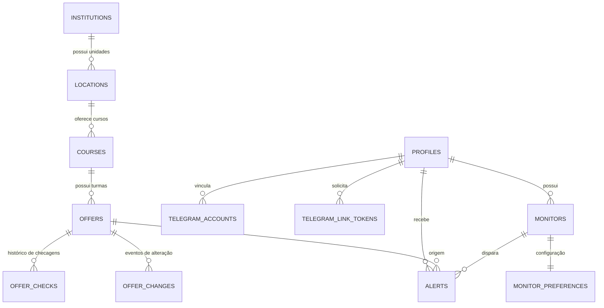

# Documento de Arquitetura — Plataforma Senac Monitor Multi-Usuário

## 1. Visão Geral
O Senac Monitor é um sistema distribuído para monitoramento contínuo de oportunidades educacionais (vagas pagas, bolsas de estudo PSG 100% gratuitas, lista de espera e abertura de novas turmas).

O sistema foi desenhado sob o princípio de **baixo acoplamento**, **alta escalabilidade de tráfego** e **segurança de dados**.

---

## 2. Princípios de Arquitetura

### 2.1 Critérios Conceituais vs. IDs de Ofertas
Usuários não monitoram IDs efêmeros de turmas do Senac (ex: `9900357333`). O usuário cadastra seu interesse conceitual:
$$\text{Instituição} \longrightarrow \text{Unidade/Campus} \longrightarrow \text{Curso} \longrightarrow \text{Turno} \longrightarrow \text{Preferências}$$

O motor de varredura (`EducationProvider`) resolve as ofertas ativas e futuras que satisfazem essa tupla conceitual.

### 2.2 Deduplicação de Requisições de Rede (Escala $O(1)$)
Mesmo que haja centenas ou milhares de usuários monitorando o mesmo curso na mesma unidade:
- O worker realiza apenas **1 única requisição HTTP** ao Senac por oferta rastreada.
- Os resultados são comparados com o estado anterior armazenado no banco (`offer_checks` e `offer_changes`).
- Se houver evento detectado, o `MatchingEngine` localiza todos os usuários compatíveis em memória e gera as notificações individuais.

### 2.3 Deduplicação de Alertas (SHA256 Fingerprint)
Para garantir idempotência e evitar qualquer risco de spam ao usuário:
$$\text{Fingerprint} = \text{SHA256}(\text{user\_id} \mathbin{\Vert} \text{offer\_id} \mathbin{\Vert} \text{event\_type} \mathbin{\Vert} \text{date\_bucket})$$
Antes de despachar o alerta, o sistema garante que o fingerprint não exista na tabela `alerts`.

### 2.4 Vinculação Segura com Telegram
Nenhum `chat_id` ou dado confidencial é inserido diretamente no navegador web:
1. Web solicita `/api/telegram/link-token`.
2. Token seguro de 32 bytes gerado com expiração de 15 minutos.
3. Bot recebe `/start <token>`.
4. Bot valida e consome o token atomicamente, registrando o vínculo em `telegram_accounts`.

---

## 3. Modelo de Entidades do Banco de Dados

---

## 4. Estrutura de Provedores (`EducationProvider`)

A interface `EducationProvider` em `app/providers/base.py` isola a lógica de coleta:
- `get_locations()`: Lista unidades disponíveis da instituição.
- `search_courses(query, location_id)`: Busca cursos oferecidos.
- `discover_offers(course_id, location_id)`: Localiza todas as turmas ativas e futuras.
- `get_offer_state(offer_id, url)`: Avalia vagas pagas, bolsas de estudo e lista de espera.

Isso permite plugar futuros provedores (Senai, Etec, Fatec) com zero alteração nas camadas de matching, alertas e frontend.
